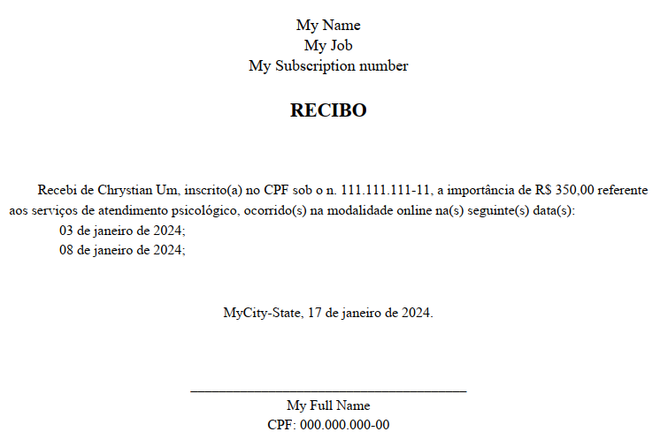

# Receipt Generator - Gerador de Recibos - Python

## Overview

This software is an automatic Receipt Generator, designed with brazilian service workers in mind (mostly Microsoft Windows users).
It basically reads receipt data from an editable xlsx file, and it is made to work as a one-click executable.
The executable can be created by using `pyinstaller` library.

### An Example

Given the input data within the `xlsx` file:


The output receipt will look like:



## How does it work?

```
📦receipt_generator_pub_repo\n
┣ 📜.gitignore\
┣ 📜gerar_recibos_pdf.py\
┣ 📜LICENSE\
┣ 📜logging_and_debugging.py\
┣ 📜make_receipt_class.py\
┣ 📜organize_data_class.py\
┣ 📜Planilha_Cadastro_Recibos.xlsx\
┣ 📜README.md\
┗ 📜requirements.txt\
```

We have four main source files:

- `gerar_recibos_pdf.py`: this file has the `main()` function and it calls the other modules.
- `logging_and_debugging.py`: this file has functions to deal with log files, which are important in case of using the one-click executable program.
- `make_receipt_class.py`: this file has a class `Receipt` which has attributes and methods suitable to make the receipt.
- `organize_data_class.py`: this file has a class `ReceiptData` which has attributes and methods suitable to deal with the data located in the `xlsx` file.

We also an xlsx example file:

- `Planilha_Cadastro_Recibos.xlsx`: this is an example file, and the source codes were written having it in mind.

## Requirements and Assumptions

The following topics are a guide for those who want to reproduce and make their changes based on this first release:

- This software has been built using OS Windows 11 22H2.
- `Python 3.11.4` has been used.
- `pip 22.3.2` has been used to intall libraries.
- Libraries needed and their versions can be found on `requirements.txt`. This can also be used via `pip` with command `python -m pip install -r requirements.txt`.
- The `exe` one-file app has been built with `pyinstaller 6.3.0`.

## Limitations

- This app is a holiday project to make my wife's life better. Many things are hard-coded and can surely be generalized.
- The app was built considering a brazilian person as a user, and many hard-coded strings are in protuguese.
- The receipt format follows the ones provided by healthcare workers in Brazil. Other styles may require significant changes, specially on the `Receipt.generate_pdf()` method.
- There are more limitation possibly not mapped.

## Licenses

This is licensed under GNU General Public License v3.0 (GNU GPLv3)
